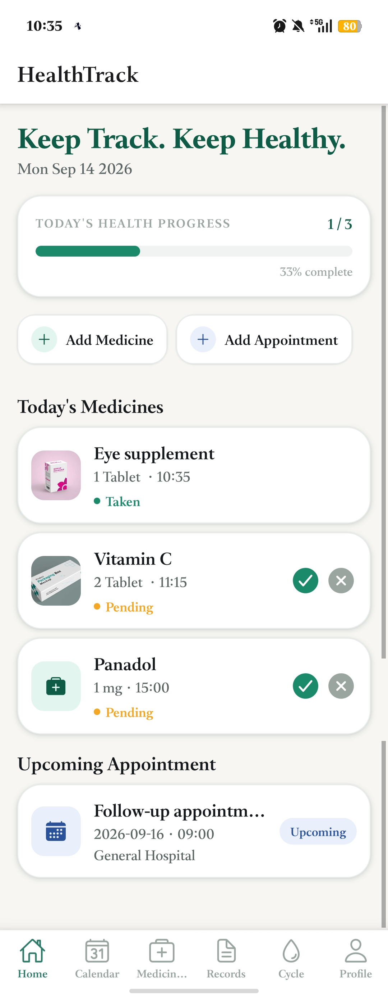
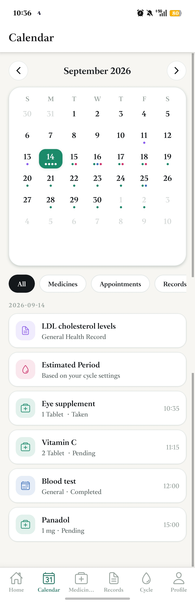
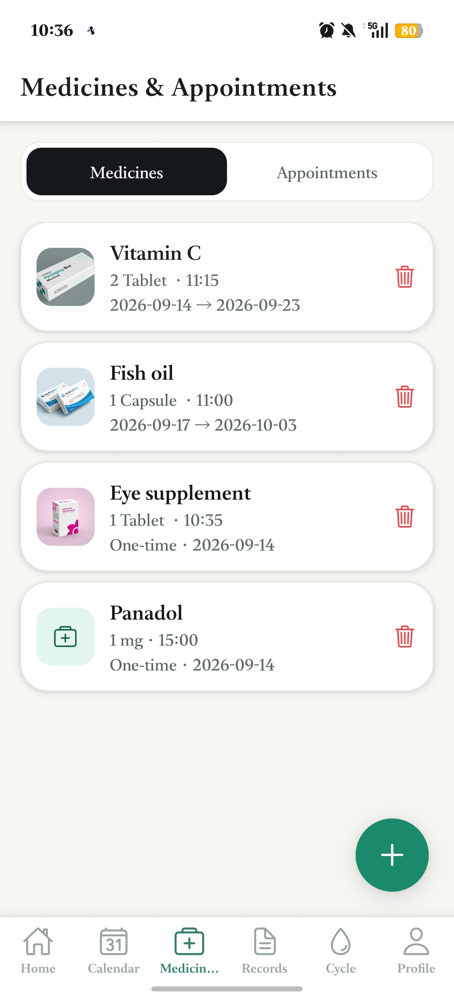
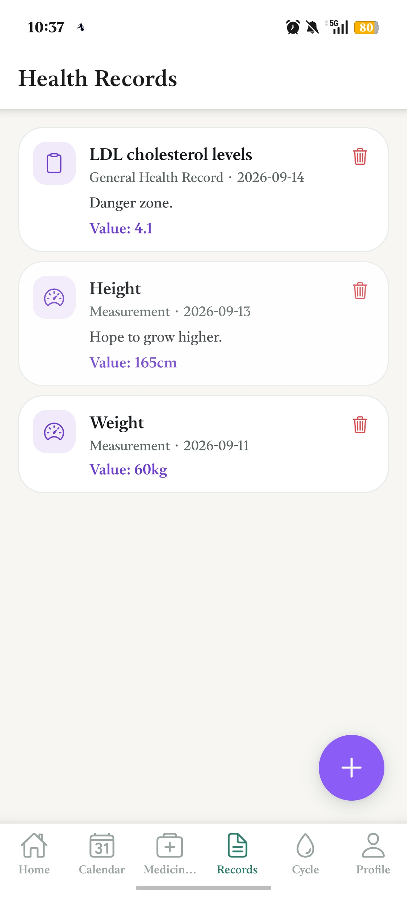
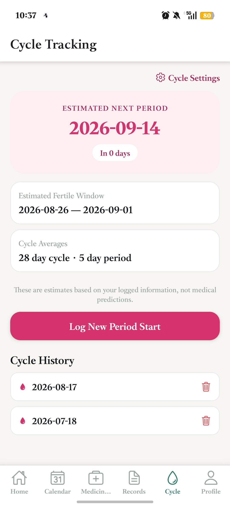
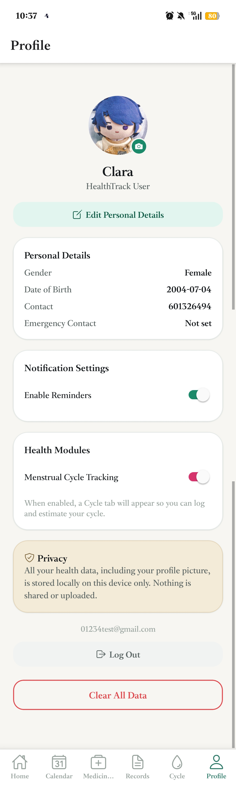
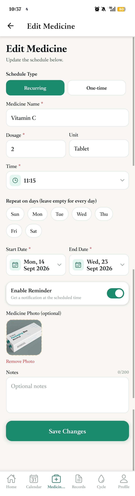
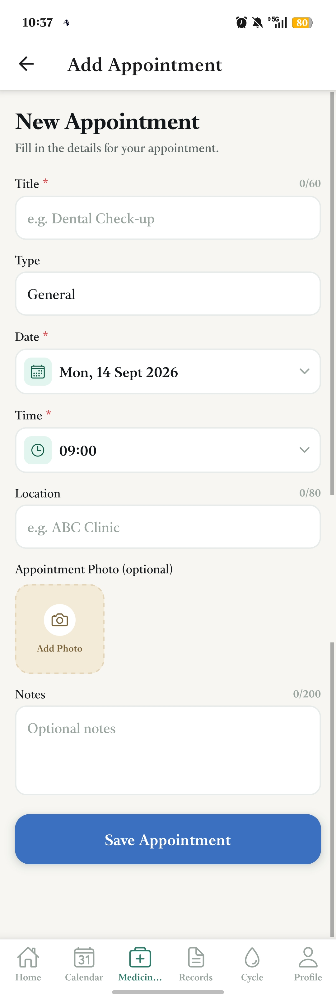
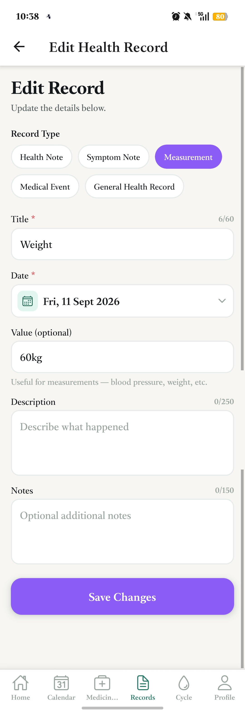
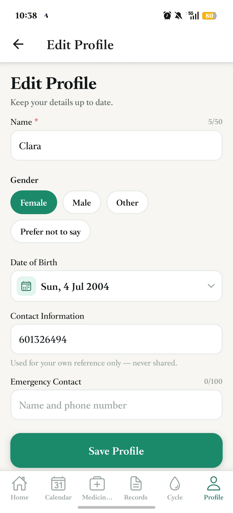

# HealthTrack 
A personal health organisation and reminder mobile application built with React Native and Expo.

**Live Expo Snack:** https://snack.expo.dev/@claratan/mdfinal-healthtrack
(version: v54.0.0)

## Overview

HealthTrack helps users organise medicines, supplements, appointments, and personal health
records in one connected, time-based system. On first launch, users create a local account
(name, email, password); on return visits they log in and stay signed in until they choose
to log out. A Home dashboard shows today's activities, a full year/month/day Calendar shows
activities by date, and a unified Timeline shows a chronological history of everything that
has happened. An optional menstrual-cycle tracking module can be enabled from Settings. Local
notifications remind users when a medicine dose or appointment is approaching.

## Visual Design
### Main Page
| Home | Calendar | Health Item | Health Record | Menstrual Cycle | Profile | 
|------|----------|-------------|---------------|-----------------|---------|
 |  |  |  |  | 
### Sub Page
| MedicalForm | AppointmentForm | HealthRecordForm | EditProfileForm |
|-------------|-----------------|------------------|-----------------|
 |   |  |  

## Setup Instructions

### Option A — Run via Expo Snack (no local setup required)
Open the Snack directly: https://snack.expo.dev/@claratan/mdfinal-healthtrack
Scan the QR code with the Expo Go app on your phone, or run in the web preview.

### Option B — Run locally from the source ZIP

**Prerequisites:** Node.js (LTS), npm, and the Expo Go app on your phone (or an
iOS/Android simulator).

Before run, make sure the package.json in downloaded zip folder is:
```bash
{
  "license": "0BSD",
  "main": "index.js",
  "scripts": {
    "start": "expo start",
    "android": "expo start --android",
    "ios": "expo start --ios",
    "web": "expo start --web",
    "test": "jest"
  },
  "dependencies": {
    "expo": "~54.0.37",
    "expo-status-bar": "~3.0.9",
    "react": "19.1.0",
    "react-native": "0.81.5",
    "expo-constants": "~18.0.14",
    "expo-crypto": "~15.0.7",
    "expo-image-picker": "~17.0.11",
    "@expo/vector-icons": "^15.0.3",
    "expo-notifications": "~0.32.17",
    "react-native-paper": "4.9.2",
    "react-native-screens": "~4.16.0",
    "@react-navigation/native": "*",
    "@react-navigation/bottom-tabs": "*",
    "@react-navigation/native-stack": "*",
    "react-native-safe-area-context": "~5.6.0",
    "@react-native-async-storage/async-storage": "2.2.0"
  },
  "private": true,
  "devDependencies": {
    "@babel/core": "^7.29.7",
    "@babel/preset-env": "^7.29.7",
    "@babel/preset-react": "^7.29.7",
    "babel-jest": "^30.5.1",
    "jest": "^29.7.0"
  },
  "jest": {
    "testEnvironment": "node",
    "setupFiles": [
      "<rootDir>/tests/jest.setup.js"
    ],
    "transform": {
      "^.+\\.js$": [
        "babel-jest",
        {
          "presets": [
            "@babel/preset-env"
          ]
        }
      ]
    }
  }
}
```

> **Note:** the `expo-crypto` version above targets Expo SDK 54. If `npx expo start` warns
> about a version mismatch, run `npx expo install expo-crypto` to let Expo pick the correct
> version for your installed SDK.

Then run:
```bash
# 1. Unzip the project and enter the folder
cd mdfinal-healthtrack

# 2. Install dependencies
npm install

# 3. Start the Expo dev server
npx expo start
```

Scan the QR code shown in the terminal with the Expo Go app, or press `a` / `i` in the
terminal to launch an Android/iOS simulator (if configured).

On first launch you'll be asked to create a local account (name, email, password, min. 6
characters). This account lives only on your device — see **Data & Privacy** below.

## Running Tests

This project uses two separate Babel configurations: `babel-preset-expo` for the app itself,
and a lightweight `@babel/preset-env`-only path for Jest, since the automated tests are pure
JavaScript and don't need React Native's runtime.

```bash
npm test
```

Expected output:
Test Suites: 7 passed, 7 total
Tests: 66 passed, 66 total


**What's covered:**
- `tests/dateUtils.test.js` — recurring date generation, date formatting/comparison, sorting
- `tests/reminderUtils.test.js` — reminder time calculation, daily progress calculation, missed-occurrence detection
- `tests/cycleCalculator.test.js` — next period estimation, fertile window, future cycle range generation
- `tests/calendarUtils.test.js` — month grid generation for the Calendar screen
- `tests/validation.test.js` — past-date/time rejection, date-range validation, time format checks
- `tests/auth.test.js` — email/password validation, account creation, login credential
  verification (including case-insensitive email matching and wrong-password/wrong-email
  rejection), session persistence, and account/session wipe on "Clear All Data", using
  mocked AsyncStorage
- `tests/integration.test.js` — full add → schedule → mark-taken → progress-update flow for
  medicines, and full add → schedule reminder → mark-completed flow for appointments, using
  mocked AsyncStorage and Expo Notifications (see `tests/jest.setup.js`)

## Features

- **Local account & login** — one-time registration (name, email, password) per device;
  passwords are hashed with SHA-256 before storage and never kept in plain text; session
  persists across app restarts until the user manually logs out
- **Home dashboard** — today's medicines, daily progress bar, upcoming appointment, quick actions
- **Medicines & Appointments** (merged screen with segmented tabs)
  - Recurring or one-time medicine schedules, with custom weekday selection
  - Past date/time validation (cannot schedule something already in the past)
  - Optional photo attached to each medicine or appointment
  - Full edit support — tap any item to update it
  - Local notification reminders, rescheduled/cancelled correctly on edit or delete
- **Health Records** — create/view/edit/delete personal health notes, symptoms, measurements, and events
- **Calendar** — full year/month/day grid with colour-coded indicators and per-type filters
  (Medicines / Appointments / Records / Cycle), tap any day to see its scheduled items
- **Timeline** — unified chronological feed (Today / Upcoming / Past) across medicines,
  appointments, and health records
- **Profile** — profile picture upload, name, gender, date of birth, contact and emergency
  contact info, notification toggle, cycle-tracking toggle, logout, clear-all-data option
- **Menstrual Cycle Tracking** (optional, enabled via Profile → Settings)
  - Log period start dates, view estimated next period and fertile window
  - Cycle history log with delete support
  - Cycle events appear automatically on the Calendar
- **Local notifications** — medicine dose reminders, appointment reminders (30 min before),
  cycle reminders (1 day before estimated period)
- **Local persistent storage** — all data stored on-device via AsyncStorage; nothing leaves
  the device

## Tech Stack

- React Native + Expo (developed via Expo Snack)
- React Navigation — bottom tabs + native stack, with a shared `ProfileContext` so the
  Cycle tab appears/disappears immediately when toggled in Settings, and an `AuthContext`
  that gates the whole tab navigator behind login
- AsyncStorage for local persistence
- expo-crypto for one-way password hashing (SHA-256)
- expo-notifications for local reminder scheduling
- expo-image-picker for profile/medicine/appointment photos
- Jest for unit and integration testing

## Data & Privacy

All data — the account (name, email, hashed password), medicines, appointments, health
records, cycle logs, and the profile (including the profile picture) — is stored locally
on-device using AsyncStorage. Nothing is transmitted to a server. Passwords are hashed with
SHA-256 before being stored and are never kept or transmitted in plain text. Users can clear
all stored data, including the account itself, at any time from Profile → Clear All Data
(this will log the user out and return the app to the registration screen).

## Notifications

HealthTrack schedules local device notifications for:
- Each medicine occurrence, at its scheduled time (if reminders are enabled for that medicine)
- Appointments, 30 minutes before the scheduled time
- Cycle reminders, 1 day before the estimated next period (if cycle tracking is enabled)

Editing or deleting a medicine/appointment correctly cancels its old notification(s) before
scheduling new ones, so reminders never go stale.

**Known limitation:** local notification scheduling was tested via Expo Go and works
correctly on the test device used for development. Expo Go's support for local scheduled
notifications can vary by platform/SDK version; a standalone development build
(`eas build --profile development`) would be the more production-representative way to
verify this on all target platforms.

## Known Limitations / Future Work

- Reminders are capped at scheduling the next 30 upcoming occurrences per medicine to avoid
  hitting OS-level notification limits on very long recurring schedules.
- The Calendar currently distinguishes cycle days generically as "Estimated Period" without
  separating logged history from future estimates in the day-detail label.
- The app supports a single local account per device by design (consistent with its
  on-device-only privacy model). It does not support multiple user profiles, password
  reset/recovery, or cross-device sync — a lost password currently requires using
  Clear All Data to reset the app.
